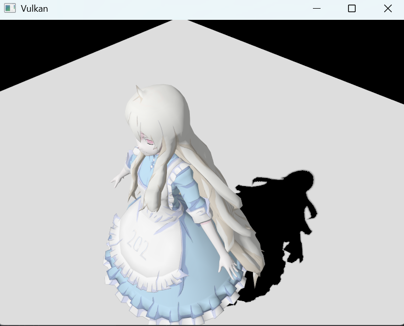
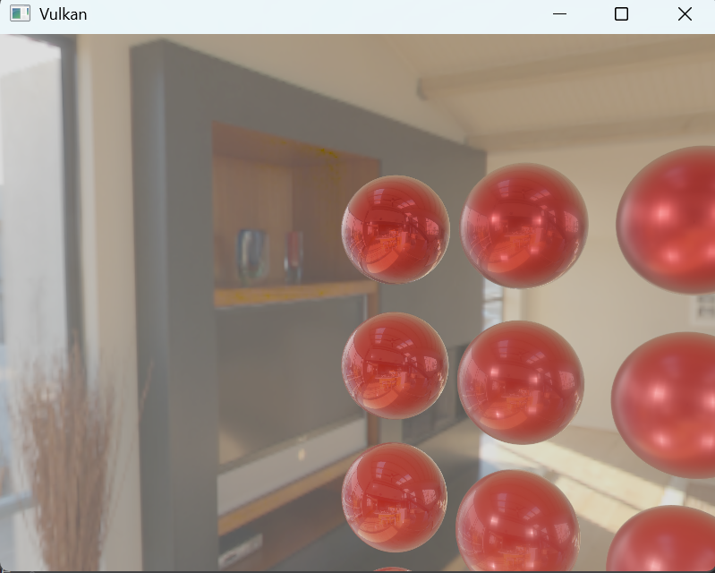
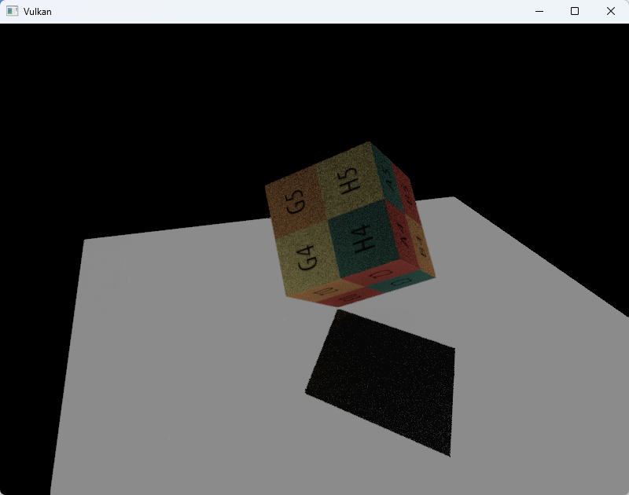
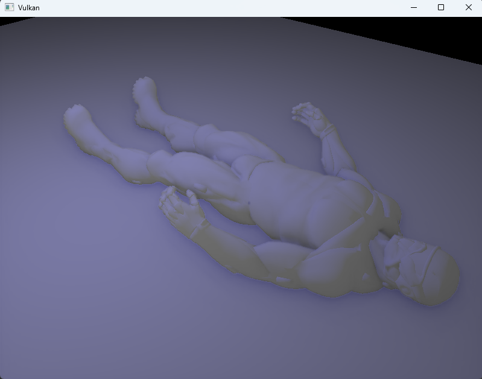

# Tree
a rendering engine based on vulkan


## Features

### 1. PCSS



### 2. PBR+IBL



### 3. SSR+HiZ



### 4. SSAO



## Build on Windows

Requirements: Visual Studio 2022 with the C++ desktop workload, CMake 3.27 or
newer, Git, and a Vulkan-capable graphics driver.

Download the pinned dependencies into `third_party`:

```powershell
powershell -ExecutionPolicy Bypass -File .\scripts\setup_dependencies.ps1
```

Configure and build all applications:

```powershell
cmake -S . -B build -G "Visual Studio 17 2022" -A x64
cmake --build build --config Release --parallel
```

The executables are written to `build/Release`. The CMake project configures
Visual Studio to find the local Vulkan validation layers when debugging.
